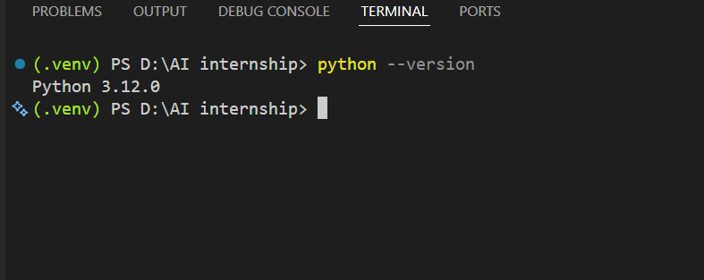
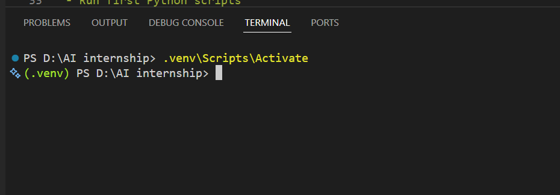
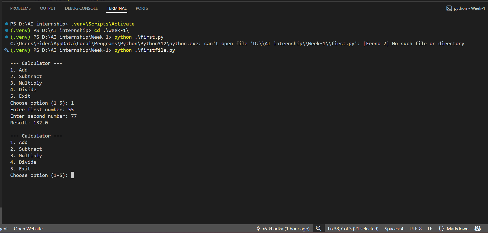

# Week 1 - Orientation and Python Setup

## Overview

This is the Week 1 deliverable for the 3-Month AI Intern program. It covers two parts: 

#### 1. proof that the development environment is set up correctly
#### 2. the first Python practice script, a simple command-line calculator.

## 1. Setup Success Proof

This section shows that the environment is ready for the rest of the internship.

### Checklist

- Python installed and working
- VS Code installed
- Virtual environment created
- First script run inside the venv

### Python Version

Command used:

```
python --version
```



### Virtual Environment

Steps used to create and activate the venv:

```
python -m venv venv
venv\Scripts\activate      (Windows)
source venv/bin/activate   (Mac/Linux)
```

Screenshot showing the terminal with the venv activated (the prompt should show `(venv)` at the start of the line):



### VS Code Running a .py File

Screenshot showing VS Code with `calculator.py` open and running in the integrated terminal:



## 2. Calculator Script

A simple calculator program that demonstrates basic arithmetic operations, functions, return values, loops, and conditional statements.

### Files

- `calculator.py` - the script version
- `calculator.ipynb` - the notebook version of the same program

### Features

- Add, subtract, multiply, and divide two numbers
- Handles division by zero with an error message instead of crashing
- Menu-driven loop so the user can run multiple calculations without restarting the program
- Exits cleanly when the user chooses the exit option

### How to Run

From inside the activated virtual environment:

```
cd Week-1
python calculator.py
```

Then follow the on-screen menu:

```
--- Calculator ---
1. Add
2. Subtract
3. Multiply
4. Divide
5. Exit
```

Enter a number from 1 to 5 to choose an operation. For options 1 to 4, the program will ask for two numbers and print the result. Option 5 exits the program.

### Code Structure

| Function | Purpose |
|---|---|
| `add(a, b)` | Returns the sum of two numbers |
| `subtract(a, b)` | Returns the difference of two numbers |
| `multiply(a, b)` | Returns the product of two numbers |
| `divide(a, b)` | Returns the quotient, or an error message if dividing by zero |
| `get_numbers()` | Prompts the user for two numbers and returns them |
| `show_menu()` | Prints the calculator menu |
| `main()` | Runs the main program loop |

### Example Run

```
--- Calculator ---
1. Add
2. Subtract
3. Multiply
4. Divide
5. Exit
Choose option (1-5): 1
Enter first number: 4
Enter second number: 5
Result: 9.0
```

## Notes

This was the first script written during Week 1 setup. It is intentionally simple and focuses on getting comfortable with functions, input/output, loops, and conditionals before moving into data handling in Week 2.
